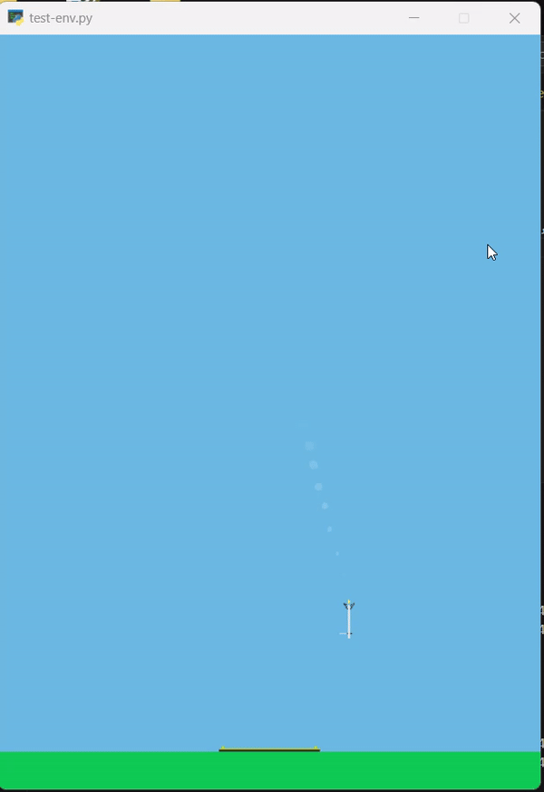
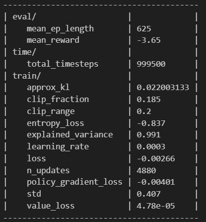

# Falcon9 Lander Gym

This is an OpenAI Gym custom environment simulating a SpaceX Falcon Rocket landing. It is highly customizable and supports both discrete and continuous inputs. This environment was originally created by Sven Niederberger (see the [original work here](https://github.com/EmbersArc/gym-rocketlander/tree/master)). I have updated the model to be compatible with newer versions of OpenAI Gymnasium, converted it into an installable package, and created test and train algorithms to test and train this custom environment.

## Project Overview

The primary objective of this environment is to land a rocket on a ship. The environment is highly customizable, supporting both discrete and continuous control inputs.

### State Variables

The state consists of the following variables:
- `x position`
- `y position`
- `angle`
- `first leg ground contact indicator`
- `second leg ground contact indicator`
- `throttle`
- `engine gimbal`

If `VEL_STATE` is set to `True`, the following velocities are included:
- `x velocity`
- `y velocity`
- `angular velocity`

All state variables are normalized for improved training.

### Control Inputs

Discrete control inputs:
- `gimbal left`
- `gimbal right`
- `throttle up`
- `throttle down`
- `use first control thruster`
- `use second control thruster`
- `no action`

Continuous control inputs:
- `gimbal (left/right)`
- `throttle (up/down)`
- `control thruster (left/right)`

## Getting Started

Follow these instructions to get the environment up and running on your local machine for development purposes. For installation or running issues, see the [INSTALLATION_FIXES](https://github.com/Chathura-Ranasinghe/Falcon9-Lander-Gym/blob/main/INSTALLATION_FIXES.md) section.

### Installing

Follow these steps to set up a development environment. Using a virtual environment is recommended to avoid conflicting dependencies.

1. Create a Python or Conda (recommended) environment. Use Python versions 3.8-3.11 to avoid dependency errors and PyTorch issues.
2. Clone the repository:
    ```bash
    git clone https://github.com/Chathura-Ranasinghe/Falcon9-Lander-Gym
    cd Falcon9-Lander-Gym/
    ```
3. Install the package:
    ```bash
    pip install .
    ```

### Testing the Custom Environment

To test whether the environment is working, run the following code:

```python
import gymnasium as gym
import gym.spaces
import falcon_lander_gym

env_name = 'FalconLander-v1'
env = gym.make(env_name)
PRINT_DEBUG_MSG = True

def run_simulation(env, num_episodes=1):
    for episode in range(num_episodes):
        observation = env.reset()
        done = False
        total_reward = 0
        step_count = 0

        while not done:
            env.render()
            action = env.action_space.sample()
            observation, reward, done, info = env.step(action)
            total_reward += reward
            step_count += 1

            if PRINT_DEBUG_MSG:
                print(f"Episode: {episode + 1}, Step: {step_count}")
                print("Action Taken  ", action)
                print("Observation   ", observation)
                print("Reward Gained ", reward)
                print("Info          ", info, end='\n\n')

        print(f"Episode {episode + 1} finished after {step_count} steps with total reward {total_reward}")

if __name__ == "__main__":
    run_simulation(env, num_episodes=20)
    env.close()
```

If everything working fine, you can see somthing like this.

 

### Training the Custom Environment

Here is a basic script to train this custom environment using the PPO algorithm:

```python
import os
import gym
import falcon_lander_gym
from stable_baselines3 import PPO
from gymnasium.envs.registration import register
from stable_baselines3.common.env_util import make_vec_env
from stable_baselines3.common.callbacks import BaseCallback

register(
    id='FalconLander-v1',
    entry_point='falcon_lander_gym.envs:FalconLander',
    max_episode_steps=1000,
    reward_threshold=0,
)

env = gym.make('FalconLander-v1')

class TrainAndLoggingCallback(BaseCallback):
    def __init__(self, check_freq, save_path, verbose=1):
        super(TrainAndLoggingCallback, self).__init__(verbose)
        self.check_freq = check_freq
        self.save_path = save_path

    def _init_callback(self):
        if self.save_path is not None:
            os.makedirs(self.save_path, exist_ok=True)

    def _on_step(self):
        if self.n_calls % self.check_freq == 0:
            model_path = os.path.join(self.save_path, 'best_model_{}'.format(self.n_calls))
            self.model.save(model_path)
        return True

CHECKPOINT_DIR = './train/'
LOG_DIR = './logs/'

env = make_vec_env(lambda: env, n_envs=4)

model = PPO('MlpPolicy', env, tensorboard_log=LOG_DIR, verbose=1)

callback = TrainAndLoggingCallback(check_freq=1000, save_path=CHECKPOINT_DIR)

model.learn(total_timesteps=1000000, callback=callback)
```

## Challenges Faced

Despite extensive training and fine-tuning, achieving a positive mean reward (`ep_rew_mean`) has been challenging. The model often results in negative rewards, indicating suboptimal landings. Continuous efforts to adjust hyperparameters and training strategies have been made to improve accuracy and performance.

 

### Possible Reasons for Suboptimal Performance

1. **Hyperparameters Tuning**
2. **Model Architecture**
3. **Environment Issues**
4. **Training Time**
5. **Exploration vs. Exploitation**
6. **Evaluation Frequency and Criteria**

I believe the issue primarily lies with hyperparameters tuning and the exploration vs. exploitation trade-off. I trained the model for a sufficient time, and the model architecture is well-defined (you can explore this yourself to verify).

## Future Work

Future improvements may include:
- Further hyperparameter tuning
- Implementing more advanced RL algorithms
- Enhancing the simulation environment
- Incorporating additional state variables and control inputs

## Contributing

I welcome contributions from the community! Feel free to fork the repository, make changes, and submit pull requests. Your insights and contributions can make a significant difference.

## Acknowledgements

Special thanks to the open-source community and [EmbersArc](https://github.com/EmbersArc/gym-rocketlander/tree/master) for providing the initial environment structure.
